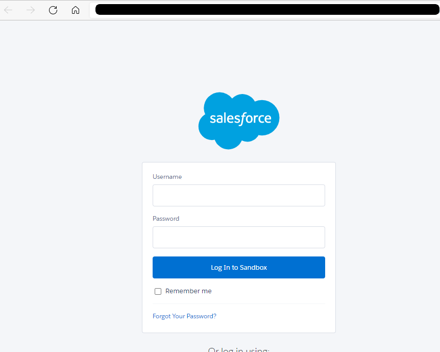
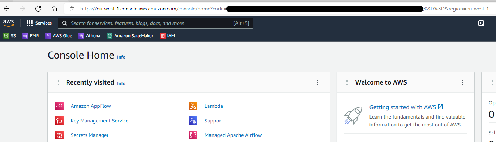

## Problem statement
AWS AppFlow supports the ability to create a connection profile from the Management Console using a point-and-click approach. However, this approach does not translate well into the world of automated deployments where developers rarely have the ability to even log into the management console of the production environment, let alone create resources. This Gist describes a process whereby a CI/CD pipeline could deploy AppFlow resources without any interaction with a UI or the management console

## Approach

### Step 1: Client ID and Client Secret
[Create a Salesforce connected application](https://docs.aws.amazon.com/appflow/latest/userguide/salesforce.html#salesforce-global-connected-app-instructions) and note down the Consumer Key and Consumer Secret. Create a secret using AWS Secrets Manager which contains these:

Powershell:
```PowerShell
aws secretsmanager create-secret --name SalesforceClientCredentials `
    --description "Consumer Key and Consumer Secret for Salesforce App" `
    --secret-string "{\`"clientId\`": \`"<consumer-key>\`", \`"clientSecret\`": \`"<consumer-secret>\`"}"
```
Note down the ARN of the secret thus created.

### Step 2: Access Token and Refresh Token
The next step uses the [Web Server OAuth Flow](https://help.salesforce.com/s/articleView?id=sf.remoteaccess_oauth_web_server_flow.htm&type=5) to obtain an access token and refresh token. Note that for this to work, the Connected App must have the `refresh_token`, `offline_access` scopes enabled. The script below needs to be run **locally** and only once. 

Powershell:
```PowerShell
<#
.SYNOPSIS
    This script implements the Web Server OAuth flow to obtain an access token and refresh token for Salesforce. These are then stored in an AWS Secrets Manager secret.

.PARAMETER secretName 
    Base name of the secret. Defaults to SalesforceCredentials. This is always suffixed by a timestamp in the format yyyy-mm-ddTHHmmss

.PARAMETER awsProfile
    AWS named profile for the account into whose secrets manager the credentials are saved
#>
param (

    [Parameter()]
    [String]
    $secretName="SalesforceCredentials",

    [Parameter()]
    [String]
    $awsProfile="dev"

)

$clientId = "<client-id>"
$redirectUri = "https://console.aws.amazon.com/console/home?region=eu-west-1" # Use the redirect-uri provided with the connected app

# Step 1: Request OAuth Code
$url1 = "https://<your-sf-domain>.my.salesforce.com/services/oauth2/authorize?response_type=code&client_id=$($clientId)&redirect_uri=$($redirectUri)"
Start-Process $url1

# Step 2: Get code from user
$prompt = Read-Host -Prompt "Enter the Salesforce OAuth Code"
$urlDecodedCode = [System.Web.HttpUtility]::UrlDecode($prompt)

# Step 3: Request OAuth tokens
$body = @{
    grant_type='authorization_code'
    client_id="$clientId"
    redirect_uri="$redirectUri"
    code="$urlDecodedCode"
}

$contentType = 'application/x-www-form-urlencoded' 
$response = Invoke-RestMethod -Uri "https://<your-sf-domain>.my.salesforce.com/services/oauth2/token" -Method 'POST' -Body $body -ContentType $contentType

# Step 4: Save tokens in secrets manager
aws secretsmanager create-secret --name "SalesforceCredentials_$(Get-Date -Format yyyy-MM-ddTHHmmss)"  --secret-string "{\`"accessToken\`":\`"$($response.access_token)\`",\`"refreshToken\`":\`"$($response.refresh_token)\`"}" --profile kdp-dev
```

After `Step-1` in the script above, the default browser opens and prompts for the username and password associated with the Salesforce App.



Once authenticated, Salesforce redirects you to the Redirect URL specified with the Connected App. The OAuth code is included as a parameter in the redirected URL as seen below



Note that the code is URL encoded and must be decoded. The script above also decodes the URL, so the entire code needs to be copied and pasted into the prompt. Next, the script creates a new secret with the access token and refresh token. After this, the CDK/Cloudformation code can be automatically deployed. Note that the above steps need to run exactly once before deploying the cloudformation stack.


